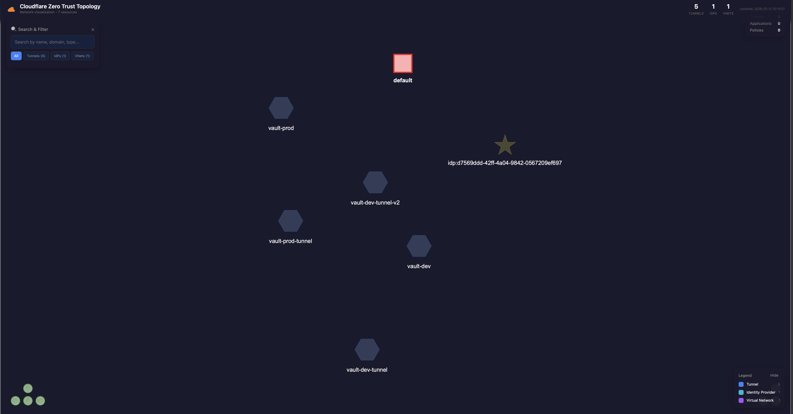

# Cloudflare Zero Trust Network Topology Mapper

<p align="center">
  
  
  
</p>

Generate interactive network topology visualizations for your Cloudflare Zero Trust infrastructure. See your tunnels, access applications, policies, identity providers, and private networks as a beautiful, interactive graph.

**Inspired by** [tailscale-network-topology-mapper](https://github.com/SimplyMinimal/tailscale-network-topology-mapper)

---

## 📸 Screenshot

<p align="center">
  
</p>

---

## ✨ Features

| Resource | Visualization |
|----------|---------------|
| 🔵 **Tunnels** | Cloudflare Tunnels with connector status, ingress rules, origin IPs |
| 🟢 **Access Applications** | Self-hosted apps, SaaS apps with domains and session duration |
| 🟡 **Access Policies** | Allow/deny/bypass rules with include/exclude/require logic |
| 🟠 **Access Groups** | Reusable identity groups with member criteria |
| 🟣 **Virtual Networks** | Private network segmentation for tunnel routing |
| 🔴 **WARP Devices** | Enrolled devices with user info and last seen status |
| 🌐 **Identity Providers** | Okta, Azure AD, Google, GitHub, and other IdPs |
| 🛡️ **Gateway Rules** | DNS and HTTP firewall policies (optional) |

### Interactive Visualization
- **Search**: Find nodes by name, domain, or type
- **Filter**: Toggle visibility by resource type  
- **Zoom & Pan**: Navigate large topologies
- **Drag**: Rearrange nodes manually
- **Tooltips**: Hover for detailed configuration info
- **Dark Theme**: Easy on the eyes, matches Cloudflare dashboard

---

## 🚀 Quick Start

### Prerequisites

- **Python 3.12+**
- **Cloudflare account** (any auth method below)

### 1. Clone & Install

```bash
git clone https://github.com/dautovri/cloudflare-topology.git
cd cloudflare-topology
pip install -r requirements.txt
```

### 2. Authenticate

**Option A — Zero config (recommended):** If you have [wrangler](https://developers.cloudflare.com/workers/wrangler/) installed and logged in, it just works:

```bash
wrangler login          # one-time: opens browser, click Allow
python main.py          # done — uses wrangler's OAuth token automatically
```

**Option B — API token:** Set the environment variable:

```bash
export CLOUDFLARE_API_TOKEN="your-api-token"
python main.py
```

> **Account ID** is auto-discovered from your token. Set `CLOUDFLARE_ACCOUNT_ID` only if your token has access to multiple accounts and you want a specific one.

<details>
<summary>📍 Where to create an API token</summary>

1. Go to [Cloudflare Dashboard → API Tokens](https://dash.cloudflare.com/profile/api-tokens)
2. Click "Create Token" → "Create Custom Token"
3. Add permissions: **Zero Trust: Read**, **Access: Apps and Policies: Read**

</details>

### 3. Generate Topology

```bash
# Basic usage - opens in browser
python main.py

# Skip tunnel configs for faster generation
python main.py --no-tunnel-configs

# Include Gateway firewall rules
python main.py --include-gateway

# Debug mode with verbose output
python main.py --debug
```

---

## 🐳 Docker Deployment

Run as a web service with automatic regeneration:

```bash
# Build
make build

# Run (requires API token — wrangler login not available in Docker)
export CLOUDFLARE_API_TOKEN="your-token"
make run

# View at http://localhost:8080
```

Or with docker directly:

```bash
docker build -t cloudflare-topology .

docker run -d \
  --name cloudflare-topology \
  -p 8080:8080 \
  -e CLOUDFLARE_API_TOKEN="your-token" \
  cloudflare-topology
```

### Docker Endpoints

| Endpoint | Method | Description |
|----------|--------|-------------|
| `/` | GET | View topology visualization |
| `/health` | GET | Health + freshness status (JSON) |
| `/regenerate` | POST | Queue a topology refresh (requires Bearer auth) |

### Environment Variables

| Variable | Default | Description |
|----------|---------|-------------|
| `CLOUDFLARE_API_TOKEN` | *(required)* | API token with Zero Trust read permissions |
| `CLOUDFLARE_ACCOUNT_ID` | auto-discover | Account ID (required only for multi-account tokens) |
| `PORT` | `8080` | Port the Flask server binds to |
| `HOST` | `0.0.0.0` | Interface the Flask server binds to |
| `REGEN_INTERVAL_SECONDS` | `900` | Scheduled regeneration interval in seconds. `0` disables the scheduler. Valid range: `0` or `>= 60`. Recommended `>= 300`. |
| `REGEN_AUTH_TOKEN` | *(unset)* | Bearer token required for `POST /regenerate`. When unset, `/regenerate` returns `403`. |

### Scheduled Regeneration

A background scheduler calls `python main.py` every `REGEN_INTERVAL_SECONDS` seconds (default: 15 minutes) and atomically replaces `network_topology.html`. Default behaviour: the container stays fresh with zero operator action.

- **Disable:** set `REGEN_INTERVAL_SECONDS=0`.
- **Customise:** `docker run -e REGEN_INTERVAL_SECONDS=1800 ...` for 30 minutes.
- **Startup:** if `network_topology.html` does not exist yet, the server generates it synchronously on boot before accepting requests.

### ⚠️ Single-Process Deployment Only

The scheduler uses in-process state (`threading.Timer` + a lock). **Do not run with multiple workers** (`gunicorn -w 2+`, uwsgi with processes, etc.) — each worker would run its own scheduler and race for the output file.

The server detects common multi-worker env vars (`WEB_CONCURRENCY`, `GUNICORN_WORKERS`, `UWSGI_WORKERS`, `GUNICORN_CMD_ARGS` with `-w N`) and refuses to start the scheduler, logging an ERROR. The HTTP endpoints still work; the topology just won't auto-refresh.

For multi-replica deployments, coordinate regeneration externally (cron, K8s CronJob, CI).

### `/regenerate` Contract

```
POST /regenerate
Authorization: Bearer <REGEN_AUTH_TOKEN>
```

| Status | Meaning | Body |
|--------|---------|------|
| `202 Accepted` | Regeneration queued on background thread | `{"status":"accepted","message":"Topology regeneration queued"}` |
| `409 Conflict` | Another regeneration is already running. Sets `Retry-After: 10`. | `{"status":"already_running","hint":"GET /health returns regen_in_progress and next_scheduled_regen_at"}` |
| `401` / `403` | Missing or invalid auth | `{"status":"error","message":"..."}` |

Fire-and-forget: the response returns as soon as the job is queued, not when the topology is ready. Poll `/health` to detect completion.

### `/health` Schema

```json
{
  "status": "healthy",
  "topology_exists": true,
  "last_generated_at": "2026-04-16T14:15:00Z",
  "regen_in_progress": false,
  "next_scheduled_regen_at": "2026-04-16T14:30:00Z"
}
```

| Field | Type | Description |
|-------|------|-------------|
| `status` | string | Always `"healthy"` when the server is up |
| `topology_exists` | bool | `true` if `network_topology.html` is present on disk |
| `last_generated_at` | ISO 8601 UTC or `null` | Timestamp of the last successful regeneration (falls back to file mtime at startup) |
| `regen_in_progress` | bool | `true` while a regeneration is running |
| `next_scheduled_regen_at` | ISO 8601 UTC or `null` | When the scheduler will fire next. `null` if the scheduler is disabled. |

### Monitoring & Debugging

Check freshness from outside the container:

```bash
curl -s http://localhost:8080/health | jq '.last_generated_at, .next_scheduled_regen_at'
```

If `last_generated_at` is older than `2 * REGEN_INTERVAL_SECONDS`, something is wrong — check container logs:

```bash
docker logs <container> 2>&1 | grep -iE 'scheduler|regenerat'
```

Scheduler thread is named `topology-scheduler` for legible stack dumps.

### Upgrade Guide: v0.1 → v0.2

- `POST /regenerate` now returns **`202 Accepted`** (queued, fire-and-forget) instead of `200 OK` after synchronous completion. Clients that only check `2xx` keep working. Clients that hard-check `status == 200` must accept `202`.
- Response body key changed from `{"status":"success", ...}` to `{"status":"accepted", ...}` on success.
- New `409 Conflict` response when a regeneration is already running; clients should respect `Retry-After: 10`.
- `/health` gains three new fields (`last_generated_at`, `regen_in_progress`, `next_scheduled_regen_at`). Existing `status` and `topology_exists` fields are unchanged.
- Output file writes are now atomic (`tempfile` + `os.replace`). No action required; readers will never observe a truncated file.

---

## 🔑 API Token Permissions

Create a token at [Cloudflare Dashboard → API Tokens](https://dash.cloudflare.com/profile/api-tokens):

### Required Permissions

| Permission | Scope | Used For |
|------------|-------|----------|
| **Zero Trust: Read** | Account | Tunnels, virtual networks, routes |
| **Access: Apps and Policies: Read** | Account | Applications, policies, groups |

### Optional Permissions

| Permission | Scope | Used For |
|------------|-------|----------|
| **Devices: Read** | Account | WARP device enrollment |
| **Gateway: Read** | Account | DNS/HTTP firewall rules |

<details>
<summary>🛡️ Recommended: Use a Custom Token</summary>

Create a token with **only** the permissions you need. Avoid using Global API Keys.

1. Go to [API Tokens](https://dash.cloudflare.com/profile/api-tokens)
2. Click "Create Token"
3. Use "Create Custom Token"
4. Add the permissions listed above
5. Set appropriate TTL and IP restrictions for security

</details>

---

## 🎨 Node Types & Colors

| Type | Color | Shape | Description |
|------|-------|-------|-------------|
| **Cloudflare** | Orange | Star | Central hub node |
| **Tunnel** | Blue `#3b82f6` | Hexagon | Cloudflare Tunnel connectors |
| **Application** | Green `#22c55e` | Circle | Access-protected applications |
| **Policy** | Yellow `#eab308` | Triangle | Access policy rules |
| **Group** | Orange `#f97316` | Circle | Access groups |
| **Identity Provider** | Cyan `#06b6d4` | Star | Okta, Azure AD, etc. |
| **Virtual Network** | Purple `#a855f7` | Square | Private network segments |
| **Route** | Lime `#84cc16` | Circle | Private network routes |
| **Device** | Red `#ef4444` | Diamond | WARP-enrolled devices |
| **Gateway Rule** | Pink `#ec4899` | Triangle | Firewall policies |

---

## ⚙️ CLI Options

```
python main.py [OPTIONS]

Options:
  --debug              Enable verbose debug logging
  --output, -o FILE    Output HTML file (default: network_topology.html)
  --no-browser         Don't auto-open browser after generation
  --no-devices         Skip fetching WARP devices (faster)
  --no-tunnel-configs  Skip fetching detailed tunnel configurations
  --include-gateway    Include Gateway firewall rules
```

### Environment Variables

| Variable | Required | Description |
|----------|----------|-------------|
| `CLOUDFLARE_API_TOKEN` | ✅* | API token with Zero Trust read permissions |
| `CLOUDFLARE_ACCOUNT_ID` | ❌ | Auto-discovered from token; set only for multi-account tokens |
| `DEBUG` | ❌ | Set to `true` for debug logging |

> \* Not needed if you use `wrangler login` (Option A above).

---

## 📁 Project Structure

```
cloudflare-topology/
├── main.py                 # CLI entry point
├── config.py               # Configuration, colors, API endpoints
├── requirements.txt        # Python dependencies
├── Dockerfile              # Container image
├── Makefile                # Build/run commands
│
├── models/
│   └── cloudflare_data.py  # Data models for all resources
│
├── services/
│   ├── cloudflare_api.py   # Cloudflare API client with pagination
│   ├── network_graph.py    # Graph builder (nodes & edges)
│   └── renderer.py         # HTML/CSS/JS visualization
│
├── server/
│   └── server.py           # Flask server for Docker
│
└── tests/
    ├── test_config.py
    ├── test_models.py
    └── test_network_graph.py
```

---

## 🧪 Development

```bash
# Install dev dependencies
pip install -r requirements.txt

# Run tests
make test
# or
python -m pytest tests/ -v

# Lint
make lint
```

---

## 🤝 Contributing

Contributions welcome! Please:

1. Fork the repository
2. Create a feature branch
3. Make your changes
4. Run tests
5. Submit a pull request

---

## 📜 License

Apache 2.0 - see [LICENSE](LICENSE) for details.

---

## 🙏 Acknowledgments

- [tailscale-network-topology-mapper](https://github.com/SimplyMinimal/tailscale-network-topology-mapper) - Original inspiration
- [Pyvis](https://pyvis.readthedocs.io/) - Python network visualization
- [vis.js](https://visjs.org/) - JavaScript graph library
- [Cloudflare](https://cloudflare.com) - Zero Trust platform

---

<p align="center">
  Made with ☁️ for the Cloudflare community
</p>
